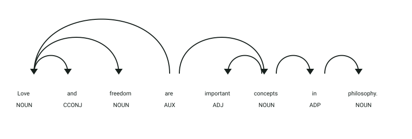

# API de detección de palabras abstractas

## Simulación interactiva del proceso

```process-demo
```

## Definición

Una palabra abstracta representa una idea, cualidad o concepto que no puede percibirse directamente mediante los sentidos.
Este servicio analiza textos en inglés y detecta palabras con un nivel alto de abstracción.

## Estructura
El servicio recibe un objeto JSON con el texto que se desea analizar:

- `text` → texto en inglés que será procesado

La respuesta contiene una lista de palabras abstractas:

- `results` → palabras detectadas sin duplicados

## Ejemplo

| **Entrada** | **Resultado** |
|-------------|---------------|
| `Love and freedom are important concepts in philosophy.` | `love`, `freedom`, `important`, `concepts`, `philosophy` |
| `The dog is sitting next to the table.` | No se detectan palabras abstractas |

## Objetivo de la api
El servicio recibe un texto en inglés y determina qué palabras presentan un nivel alto de abstracción. Devuelve un objeto con la clave `results` y la lista de palabras detectadas.

## Estrategia
La api buscará los **componentes característicos de las palabras abstractas:**

1. **Tokenización:** procesa el texto con spaCy y conserva los tokens relevantes.
2. **Embeddings:** representa las palabras mediante FastText.
3. **Predicción de concreción:** utiliza un modelo XGBoost entrenado con puntuaciones de concreción.
4. **Cálculo de abstracción:** calcula `abstractness = 6 - concreteness`.
5. **Filtrado:** conserva las palabras con abstracción mayor o igual que `3` y elimina duplicados.

## Ejemplos Visuales

### Análisis de Oración con Términos de Alta Abstracción

```json
{
  "text": "Love and freedom are important concepts in philosophy."
}
```



**Análisis sintáctico y etiquetas (POS y DEP):**
- **`Love` (`NOUN`, `nsubj`)** y **`freedom` (`NOUN`, `conj`)**: Núcleos nominales coordinados que actúan como sujetos semánticos abstractos.
- **`important` (`ADJ`, `amod`)**: Modificador adjetival de cualidad evaluativa sobre el sustantivo `concepts`.
- **`concepts` (`NOUN`, `attr`)**: Atributo nominal del predicado con el verbo copulativo `are`.
- **`philosophy` (`NOUN`, `pobj`)**: Sustantivo objeto de la preposición `in`.

**Detección del modelo:**
Las palabras de contenido analizadas (`love`, `freedom`, `important`, `concepts`, `philosophy`) presentan una puntuación de abstracción superior o igual a `3`, mientras que los tokens funcionales (`and`, `are`, `in`) se descartan en la etapa de filtrado lingüístico.

```json
{
  "results": ["love", "freedom", "important", "concepts", "philosophy"]
}
```
