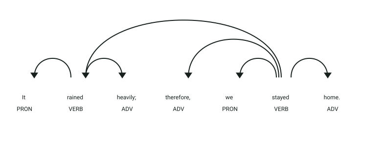
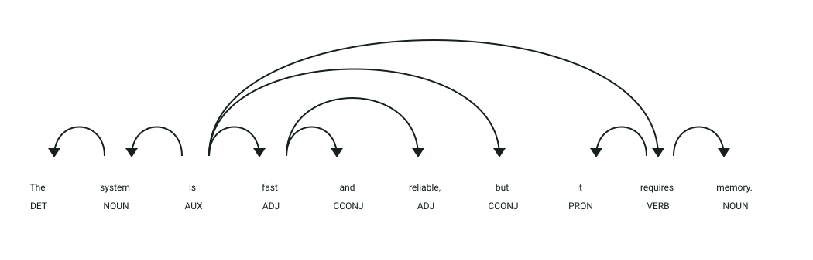

# API de detección de conectores lógicos

## Simulación interactiva del proceso

```process-demo
```

## Definición

Los conectores lógicos relacionan ideas dentro de un texto y expresan relaciones como adición, contraste, causa o conclusión.
Este servicio detecta conectores lógicos en textos en inglés y los clasifica por tipo.

## Estructura
El servicio recibe un objeto JSON:

- `text` → texto en inglés que será analizado

La respuesta contiene:

- `original_text` → texto original
- `connectors_found` → conectores encontrados y su tipo
- `normal_words` → palabras que no fueron identificadas como conectores
- `total` → cantidad total de conectores

## Ejemplo

| **Entrada** | **Resultado** |
|-------------|---------------|
| `Dog and cat or rabbit` | `and` → `addition`, `or` → `disjunction` |
| `It rained, therefore we stayed home.` | `therefore` → `conclusion` |

## Objetivo de la api
El servicio recibe un texto en inglés, detecta los conectores lógicos presentes y devuelve su clasificación junto con las palabras normales y el total encontrado.

## Estrategia
La api buscará los **componentes característicos de los conectores lógicos:**

1. **Normalización:** convierte el texto a minúsculas y elimina la puntuación.
2. **Frases compuestas:** busca primero conectores formados por varias palabras.
3. **Palabras individuales:** busca después los conectores de una sola palabra.
4. **Control de coincidencias:** evita solapamientos entre resultados.
5. **Clasificación:** asigna categorías como `addition`, `disjunction`, `contrast`, `cause-effect`, `sequence`, `exemplification`, `conclusion` y `condition`.

## Ejemplos Visuales

### Ejemplo 1: Conector Adverbial Conclusivo (`"therefore"`)

```json
{
  "text": "It rained heavily; therefore, we stayed home."
}
```



**Análisis sintáctico y etiquetas (POS y DEP):**
- **`therefore` (`ADV`, `advmod`)**: Funciona como un modificador adverbial que conecta la causa previa (*it rained*) con la cláusula principal subsiguiente (*we stayed home*).
- El servicio clasifica `therefore` dentro de la categoría semántica **`conclusion`**.
- La respuesta identifica `therefore` como conector y separa las palabras de contenido (`rained`, `heavily`, `stayed`, `home`).

---

### Ejemplo 2: Conectores Coordinantes de Adición y Contraste (`"and"`, `"but"`)

```json
{
  "text": "The system is fast and reliable, but it requires memory."
}
```



**Análisis sintáctico y etiquetas (POS y DEP):**
- **`and` (`CCONJ`, `cc`)**: Conjunción coordinante que une dos atributos adjetivales (`fast` y `reliable`). Clasificada por el servicio como **`addition`**.
- **`but` (`CCONJ`, `cc`)**: Conjunción adversativa que enlaza dos proposiciones contrapuestas. Clasificada por el servicio como **`contrast`**.
- El diagrama de dependencias ilustra cómo las flechas sintácticas parten de los predicados coordinados hacia sus conjunciones.

Respuesta generada por la API:
```json
{
  "connectors_found": [
    {"word": "and", "type": "addition"},
    {"word": "but", "type": "contrast"}
  ],
  "normal_words": ["system", "fast", "reliable", "requires", "memory"],
  "total": 2
}
```
