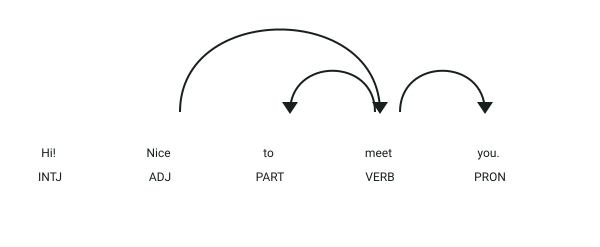

# API de detección de puntuación inusual

## Definición

La puntuación ayuda a separar las ideas y a entender cómo debe leerse un texto. A veces un texto contiene signos que aparecen en un lugar inesperado, están repetidos o no tienen su signo de cierre correspondiente.

Este servicio analiza textos en inglés y avisa cuando encuentra alguno de esos casos. Por ejemplo, puede detectar `Hi!..,` o un paréntesis que se abre pero nunca se cierra.

## Estructura

El servicio recibe un objeto JSON:

- `text` → texto en inglés que será analizado

La respuesta contiene:

- `unusual_punctuation` → valor booleano que indica si se encontró puntuación inusual
- `positions` → lista de los signos detectados o `0` cuando el texto no presenta irregularidades

El nombre `positions` se mantiene por compatibilidad con la API, pero su contenido son los signos encontrados, no sus posiciones numéricas dentro del texto.

## Ejemplo

| **Entrada** | **Resultado** |
|-------------|---------------|
| `Hi! Nice to meet you.` | `unusual_punctuation: false` |
| `Hi!.., Nice to meet you` | `unusual_punctuation: true` y signos `!` y `,` |
| `Read this (carefully.` | `unusual_punctuation: true` por el paréntesis sin cerrar |

## Objetivo de la api

El servicio recibe un texto en inglés y determina si su puntuación podría dificultar la lectura o indicar un error de escritura. No corrige el texto: únicamente informa si encontró signos sospechosos y cuáles son.

## Estrategia

La api revisa los **casos más comunes de puntuación inusual**:

1. **Signos consecutivos:** busca dos o más signos seguidos. La secuencia `...` se considera válida y no se marca.
2. **Signo pegado a una palabra:** detecta casos como `Hello!World`, donde falta un espacio después del signo.
3. **Delimitadores:** comprueba que los paréntesis, corchetes y llaves estén abiertos y cerrados en el orden correcto.
4. **Resultado:** devuelve `true` y los signos encontrados si detecta algún problema; si no, devuelve `false` y `0`.

## Ejemplos Visuales

### Caso 1: Texto con Puntuación Normal y Válida

```json
{
  "text": "Hi! Nice to meet you."
}
```



**Análisis sintáctico y etiquetas (POS y DEP):**
- **Signo de exclamación `!` (`PUNCT`, `punct`)**: Se adjunta sintácticamente como delimitador de la interjección `Hi` (`INTJ`).
- **Punto final `.` (`PUNCT`, `punct`)**: Delimita la cláusula verbal principal presidida por `meet` (`VERB`).
- **Comportamiento esperado:** En una oración bien formada, cada signo de puntuación tiene asignada la dependencia **`punct`** hacia su núcleo léxico correspondiente, sin acumulación de signos adyacentes contradictorios ni delimitadores huérfanos.

Respuesta devuelta por la API:
```json
{
  "unusual_punctuation": false,
  "positions": 0
}
```

---

### Caso 2: Texto con Puntuación Inusual y Aglomerada

```json
{
  "text": "Hi!.., Nice to meet you"
}
```

**Análisis del detector:**
- **Secuencia anómala `!..,`**: La presencia de un signo de exclamación inmediatamente seguido de puntos y comas consecutivos rompe las reglas sintácticas estándar y no corresponde a una elipsis válida (`...`).
- **Detección por patrones:** El servicio detecta los signos consecutivos e informa su presencia en el atributo `positions`:

```json
{
  "unusual_punctuation": true,
  "positions": ["!", ","]
}
```