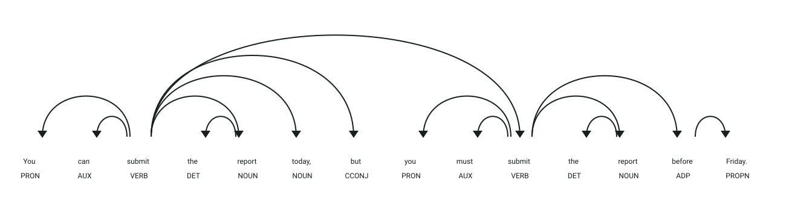

# API de detección de inconsistencias de verbos modales

## Simulación interactiva del proceso

```process-demo
```

## Definición

Los verbos modales expresan obligación, prohibición, recomendación, posibilidad o permiso.
Este servicio detecta acciones similares que aparecen asociadas con categorías modales diferentes.

## Estructura
El microservicio expone el endpoint HTTP `POST /analizar` (puerto `8006`) recibiendo un objeto JSON:

- `texto` → texto en inglés que será analizado en busca de inconsistencias modales

La respuesta devuelve un objeto JSON estructurado con el modelo `AnalisisResponse`:

- `inconsistencies` → lista de pares inconsistentes detectados (`Par`):
  - `shared_action` → acción o palabras clave compartidas entre ambas cláusulas
  - `case_1` → primer caso modal detectado (`modal`, `category`, `action`, `sentence`)
  - `case_2` → segundo caso modal detectado (`modal`, `category`, `action`, `sentence`)

## Ejemplo

| **Entrada** | **Resultado** |
|-------------|---------------|
| `You can submit the report. You must submit the report.` | Inconsistencia detectada entre `posibilidad/permiso` y `obligacion` para la acción `submit report`. |
| `You must wear a helmet. You should wear a helmet.` | Inconsistencia detectada entre `obligacion` y `recomendacion`. |

## Objetivo de la api
El servicio recibe un texto en inglés y encuentra acciones repetidas que fueron expresadas con verbos modales de categorías semánticas diferentes (como contraponer permiso u opción frente a una obligación estricta).

## Estrategia
La api buscará los **componentes característicos de las inconsistencias modales:**

1. **Separación:** divide el texto en oraciones.
2. **Detección:** identifica frases modales mediante expresiones regulares.
3. **Prioridad:** procesa primero las frases modales largas y luego las formas simples.
4. **Extracción:** obtiene la acción que aparece después del modal.
5. **Comparación:** compara palabras significativas entre acciones y reporta un par cuando comparte al menos dos palabras y cubre al menos el 50 % de la acción menor.

## Ejemplos Visuales

### Inconsistencia Modal: Posibilidad/Permiso (`can`) vs. Obligación (`must`)

Petición HTTP a `POST /analizar`:
```json
{
  "texto": "You can submit the report today, but you must submit the report before Friday."
}
```



**Análisis sintáctico y etiquetas (POS y DEP):**
- **`can` (`AUX`, `aux`)**: Auxiliar modal dependiente del primer verbo de acción `submit` (**`ROOT`**). Pertenece a la categoría semántica **`posibilidad/permiso`**.
- **`must` (`AUX`, `aux`)**: Auxiliar modal dependiente del segundo verbo de acción coordinado `submit` (`conj`). Pertenece a la categoría semántica **`obligación`**.
- **Acción compartida (`submit the report`)**: En ambas cláusulas, el predicado rige el mismo sintagma objeto directo `report` (`NOUN`, `dobj`).
- **Detección de inconsistencia:** El servicio extrae las acciones gobernadas por los modales, comprueba que comparten términos clave (`submit`, `report`) y alerta sobre la contradicción semántica entre conceder permiso opcional (*you can*) e imponer una exigencia estricta (*you must*).

Respuesta del endpoint `POST /analizar` (`AnalisisResponse`):
```json
{
  "inconsistencies": [
    {
      "shared_action": "report, submit",
      "case_1": {
        "modal": "can",
        "category": "posibilidad/permiso",
        "action": "submit the report today",
        "sentence": "You can submit the report today, but you must submit the report before Friday."
      },
      "case_2": {
        "modal": "must",
        "category": "obligación",
        "action": "submit the report before Friday",
        "sentence": "You can submit the report today, but you must submit the report before Friday."
      }
    }
  ]
}
```
