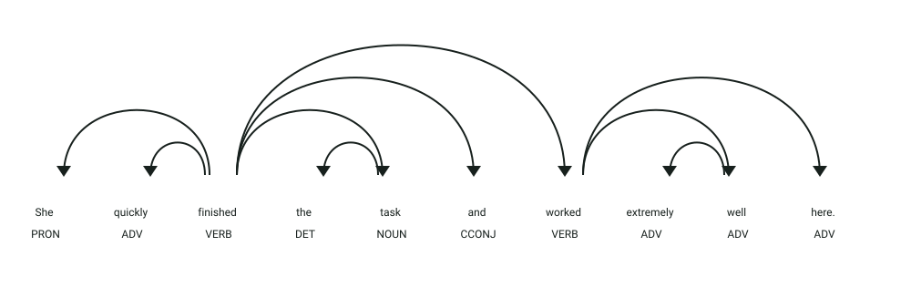

# API de detección y clasificación de adverbios

## Simulación interactiva del proceso

```process-demo
```

## Definición

Un adverbio es una palabra que modifica un verbo, un adjetivo u otro adverbio.
Este servicio analiza textos en inglés, identifica adverbios y los clasifica según su función.

## Estructura
El servicio recibe un objeto JSON:

- `texto` → texto en inglés que será analizado

La respuesta contiene una lista de adverbios clasificados:

- `adverbs` → palabras detectadas con su categoría
- `word` → adverbio encontrado
- `category` → categoría gramatical del adverbio

## Ejemplo

| **Entrada** | **Resultado** |
|-------------|---------------|
| `The dog is here.` | `here` → `Place` |
| `She quickly finished the task.` | `quickly` → `Manner` |

## Objetivo de la api
El servicio recibe un texto en inglés y devuelve los adverbios encontrados junto con su categoría, sin modificar el texto original.

## Estrategia
La api buscará los **componentes característicos de los adverbios:**

1. **Análisis lingüístico:** procesa el texto con spaCy y el modelo `en_core_web_trf`.
2. **Diccionario:** fuerza la etiqueta `ADV` para ciertos lemas definidos en el diccionario del servicio.
3. **Clasificación:** consulta las categorías configuradas para cada adverbio.
4. **Regla de terminación:** clasifica como `Manner` los adverbios que terminan en `ly` cuando no tienen otra categoría definida.

## Ejemplos Visuales

### Identificación y Clasificación de Adverbios con Modificación Sintáctica (`advmod`)

```json
{
  "texto": "She quickly finished the task and worked extremely well here."
}
```



**Análisis sintáctico y etiquetas (POS y DEP):**
- **`quickly` (`ADV`, `advmod`)**: Modificador adverbial dependiente del verbo `finished` (**`ROOT`**). Clasificado por regla morfológica (`-ly`) y diccionario como **`Manner`**.
- **`extremely` (`ADV`, `advmod`)**: Modificador de grado dependiente de otro adverbio (`well`), ilustrando la capacidad de los adverbios de modificar a otros adverbios. Clasificado como **`Degree`**.
- **`well` (`ADV`, `advmod`)**: Adverbio de modo dependiente del verbo `worked` (`conj`). Clasificado como **`Manner`**.
- **`here` (`ADV`, `advmod`)**: Adverbio locativo dependiente de `worked`. Clasificado por el diccionario como **`Place`**.

Respuesta devuelta por el servicio:
```json
{
  "adverbs": [
    {"word": "quickly", "category": "Manner"},
    {"word": "extremely", "category": "Degree"},
    {"word": "well", "category": "Manner"},
    {"word": "here", "category": "Place"}
  ]
}
```
