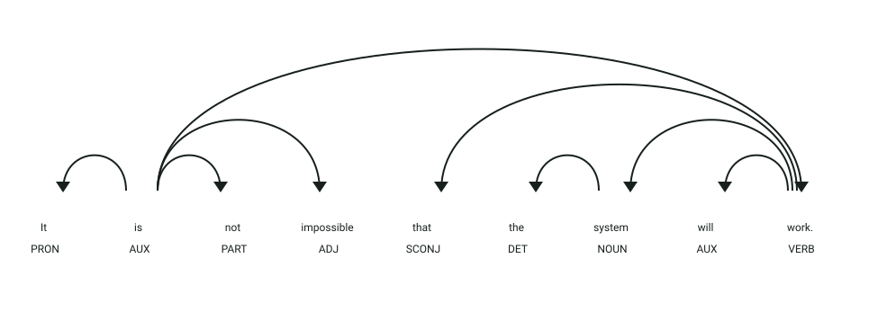
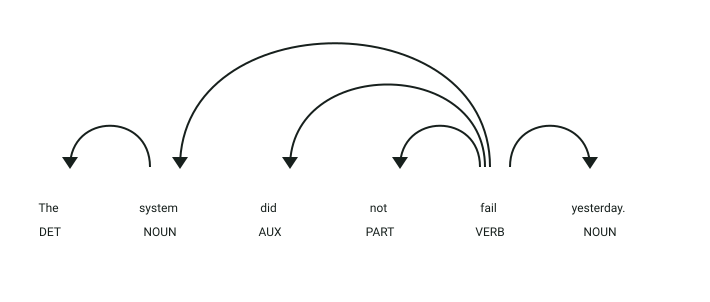

# API de detección de doble negación

## Definición

La doble negación ocurre cuando una misma cláusula contiene dos elementos negativos.
Este servicio analiza textos en inglés e identifica si presentan este fenómeno.

## Estructura
El servicio recibe un objeto JSON:

- `text` → texto en inglés que será analizado

La respuesta contiene:

- `text` → texto original
- `has_double_negation` → valor booleano que indica si existe doble negación

## Ejemplo

| **Entrada** | **Resultado** |
|-------------|---------------|
| `It's not impossible that she will come.` | `has_double_negation: true` |
| `She did not come.` | `has_double_negation: false` |

## Objetivo de la api
El servicio recibe un texto en inglés y determina si contiene al menos dos elementos negativos en una misma cláusula u oración.

## Estrategia
La api buscará los **componentes característicos de la doble negación:**

1. **Análisis sintáctico:** procesa el texto con spaCy y `en_core_web_trf`.
2. **Dependencias negativas:** cuenta tokens con dependencia `neg`.
3. **Diccionario:** reconoce palabras negativas configuradas en el servicio.
4. **Prefijos negativos:** reconoce palabras con prefijos como `un-`, `in-`, `im-`, `dis-` y `non-`.
5. **Decisión:** devuelve positivo cuando el conteo llega a dos negaciones.

## Ejemplos Visuales

### Caso 1: Doble Negación Sintáctica y Morfológica (`has_double_negation: true`)

```json
{
  "text": "It is not impossible that the system will work."
}
```



**Análisis sintáctico y etiquetas (POS y DEP):**
- **`not` (`PART`, `neg`)**: Partícula negativa con dependencia sintáctica explícita **`neg`** dependiente del verbo copulativo `is` (**`ROOT`**). Aporta la 1.ª negación.
- **`impossible` (`ADJ`, `acomp`)**: Complemento adjetival portador del prefijo negativo morfológico **`im-`** (reconocido en la estrategia del detector). Aporta la 2.ª negación.
- Al coincidir la partícula sintáctica `neg` y el término con prefijo negativo en la misma estructura, el contador alcanza 2 y el detector confirma doble negación:

```json
{
  "text": "It is not impossible that the system will work.",
  "has_double_negation": true
}
```

---

### Caso 2: Negación Simple Estándar (`has_double_negation: false`)

```json
{
  "text": "The system did not fail yesterday."
}
```



**Análisis sintáctico y etiquetas (POS y DEP):**
- **`not` (`PART`, `neg`)**: Modifica al auxiliar `did` (`aux`) y a la raíz `fail` (`ROOT`).
- No existen pronombres negativos (`nothing`, `nobody`), adverbios negativos (`never`) ni palabras con prefijos morfológicos negativos en la oración.
- Conteo de negaciones = 1 -> `has_double_negation: false`.
