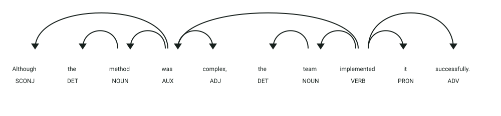

# API de métricas de legibilidad

## Simulación interactiva del proceso

```process-demo
```

## Definición

La legibilidad mide la dificultad de comprensión de un texto.
Este servicio calcula un índice Gunning Fog extendido con una penalización relacionada con el uso de comas.

## Estructura
El servicio recibe un objeto JSON:

- `texto` → texto en inglés que será analizado
- `penalizacion` → nivel `minimum`, `low`, `medium` o `high`

La respuesta incluye el resultado y los valores utilizados en el cálculo:

- `score` → puntuación extendida
- `gunning_fog` → índice Gunning Fog tradicional
- `comma_penalty` → penalización por comas
- `comma_ratio` → proporción de comas respecto a palabras
- `words_per_sentence` → promedio de palabras por oración
- `alpha` → coeficiente del nivel seleccionado

## Ejemplo

| **Entrada** | **Resultado** |
|-------------|---------------|
| `The text to analyze.` con `medium` | Respuesta con `score`, `gunning_fog` y penalización por comas |
| Texto con más comas | Mayor penalización cuando se mantiene el mismo nivel |

## Objetivo de la api
El servicio recibe un texto en inglés y devuelve una métrica de legibilidad extendida que considera tanto el índice Gunning Fog como la densidad de comas.

## Estrategia
La api buscará los **componentes característicos de la métrica de legibilidad:**

1. **Análisis lingüístico:** procesa el texto con spaCy y `textdescriptives`.
2. **Índice base:** calcula el índice Gunning Fog tradicional.
3. **Densidad:** calcula la proporción de comas respecto al número de palabras.
4. **Penalización:** aplica `penalización = alpha * (comas / palabras) * 100`.
5. **Resultado:** suma la penalización al índice base para obtener el `score` extendido.

## Ejemplos Visuales

### Análisis de Complejidad Sintáctica y Puntuación en Legibilidad

```json
{
  "texto": "Although the method was complex, the team implemented it successfully.",
  "penalizacion": "medium"
}
```



**Análisis sintáctico y etiquetas (POS y DEP):**
- **`Although` (`SCONJ`, `mark`)**: Marcador de subordinación que introduce la cláusula adverbial subordinada (**`advcl`**). Las oraciones complejas con múltiples cláusulas aumentan la métrica sintáctica y el promedio de palabras por oración (`words_per_sentence`).
- **Coma `,` (`PUNCT`, `punct`)**: Delimita la cláusula subordinada frente a la principal. El detector extrae el recuento de comas respecto al total de palabras para calcular `comma_ratio` y aplicar la penalización ajustada (`comma_penalty = alpha * comma_ratio * 100`).
- **`implemented` (`VERB`, `ROOT`)**: Verbo polisilábico principal, factor que influye directamente en el cálculo del índice Gunning Fog tradicional.
- **`successfully` (`ADV`, `advmod`)**: Modificador adverbial polisilábico.

Respuesta generada por la API:
```json
{
  "score": 11.45,
  "gunning_fog": 9.85,
  "comma_penalty": 1.60,
  "comma_ratio": 0.10,
  "words_per_sentence": 10.0,
  "alpha": 16.0
}
```
