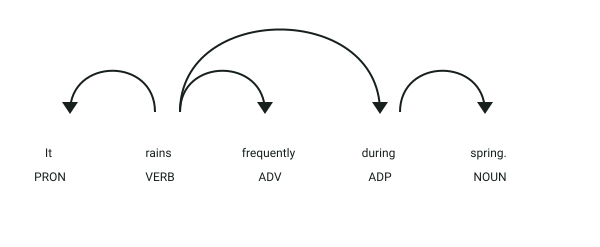
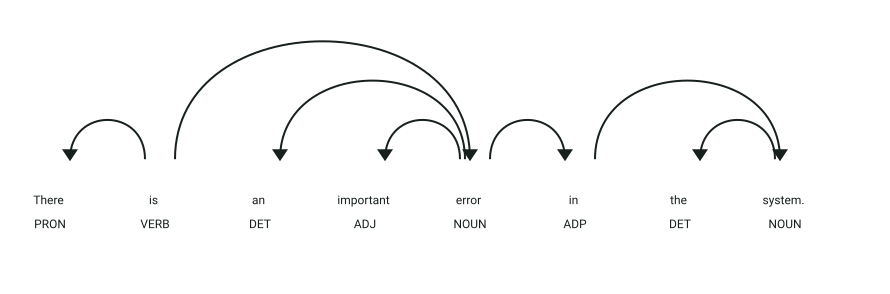
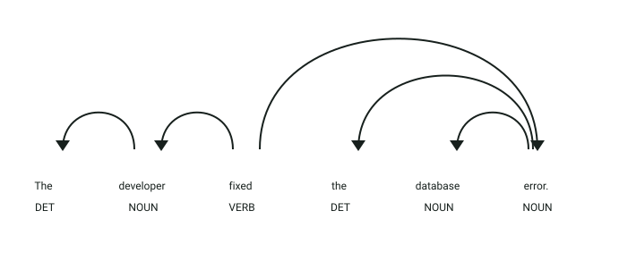

# API de detección de oraciones impersonales

## Definición

Una oración impersonal no presenta un sujeto que realice la acción de forma explícita.
Este servicio clasifica cada oración en inglés como personal, impersonal o ambigua.

## Estructura
El servicio recibe un objeto JSON:

- `text` → texto en inglés que será separado y analizado por oraciones

La respuesta clasifica cada oración según las reglas del detector.

## Ejemplo

| **Entrada** | **Resultado** |
|-------------|---------------|
| `It rains.` | Impersonal meteorológica |
| `I bought a car.` | Personal |
| `It is fast.` | Personal o ambigua según el análisis de reglas |

## Objetivo de la api
El servicio recibe un texto en inglés, analiza sus oraciones y determina si cada una es personal, impersonal o ambigua.

## Estrategia
La api buscará los **componentes característicos de las oraciones impersonales:**

1. **Separación:** divide el texto en oraciones.
2. **Existencial:** busca construcciones con `there`.
3. **Meteorológica:** busca el sujeto `it` y adjetivos o verbos meteorológicos.
4. **Pasiva impersonal:** identifica construcciones pasivas sin agente personal.
5. **Extraposition:** reconoce construcciones con `it` anticipatorio.
6. **Comparación:** combina estas reglas con las de sujetos pronominales, nominales e imperativos para clasificar la oración.

## Ejemplos Visuales

### Caso 1: Impersonal Meteorológica con Sujeto Expletivo (`"It rains..."`)

```text
It rains frequently during spring.
```



**Análisis sintáctico y etiquetas (POS y DEP):**
- **`It` (`PRON`, `nsubj`)**: Pronombre sin referente real que ocupa la posición sintáctica obligatoria de sujeto.
- **`rains` (`VERB`, `ROOT`)**: Verbo meteorológico principal.
- El detector identifica el lema meteorológico junto al sujeto ficticio `it` y clasifica la cláusula como **impersonal meteorológica**.

---

### Caso 2: Impersonal Existencial con Sujeto `expl` (`"There is..."`)

```text
There is an important error in the system.
```



**Análisis sintáctico y etiquetas (POS y DEP):**
- **`There` (`PRON`, `expl`)**: Presenta la etiqueta de dependencia **`expl`** (*expletive*), indicando explícitamente una construcción existencial en inglés.
- **`is` (`VERB`, `ROOT`)**: Verbo copulativo/existencial que rige la estructura.
- **`error` (`NOUN`, `attr`)**: Sujeto lógico real que se introduce tras el verbo.
- La presencia de la relación `expl` activa la regla de clasificación **impersonal existencial**.

---

### Caso 3: Oración Personal para Contraste

```text
The developer fixed the database error.
```



**Análisis sintáctico y etiquetas (POS y DEP):**
- **`developer` (`NOUN`, `nsubj`)**: Sustantivo agente que ejecuta conscientemente la acción.
- **`fixed` (`VERB`, `ROOT`)**: Verbo transitivo activo con objeto directo `error` (`NOUN`, `dobj`).
- Al contar con un sujeto nominal identificable y no encajar en patrones meteorológicos o existenciales, se clasifica como **personal**.
