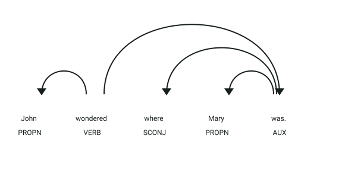
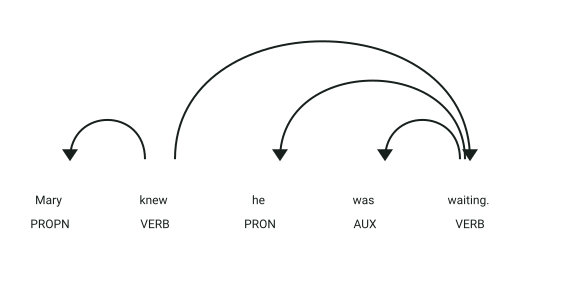

# API de detección de cambio de punto de vista (POV Shift)

## Simulación interactiva del proceso

```process-demo
```

## Definición

El punto de vista (*Point of View* o POV) define la perspectiva desde la cual se narra y experimenta un texto.
Un cambio de punto de vista no intencionado o abrupto ocurre cuando la narración salta de la experiencia interna o psicológica de un personaje a la de otro sin la debida transición.

## Estructura

El microservicio expone el endpoint HTTP `POST /detect` (puerto `8014`) recibiendo un objeto JSON:

- `texto` → texto en inglés que será analizado en busca de saltos de perspectiva narrativa

La respuesta devuelve una lista de objetos JSON con las inconsistencias de POV detectadas (`POVShift`):

- `from_character` → personaje que poseía el foco narrativo previo (`id`, `canonical_name`, `mentions`)
- `to_character` → personaje hacia el cual migró el foco narrativo (`id`, `canonical_name`, `mentions`)
- `sentence_index` → índice de la oración donde se produce la transición
- `confidence` → nivel de confianza de la detección (0.0 a 1.0)
- `evidence` → lista de razones lingüísticas que sustentan la alerta

## Ejemplo

| **Entrada** | **Resultado** |
|-------------|---------------|
| `John wondered where Mary was. Mary knew he was waiting.` | Cambio de POV detectado: `John` → `Mary` en la oración 1 con confianza `0.85`. |
| `John opened the door. Mary entered the room.` | No se detecta cambio de POV (acciones físicas observables sin acceso a estados internos). |
| `John wondered where Mary was. He felt nervous.` | No se detecta cambio de POV (la coreferencia mantiene el foco en `John`). |

## Objetivo de la api

El servicio recibe un texto en inglés y analiza el flujo de focalización narrativa a través de las oraciones. Distingue entre meras acciones físicas externas y estados internos (cognitivos, emocionales y perceptivos), alertando cuando el autor salta de la mente de un personaje a la de otro de forma injustificada.

## Estrategia

La api buscará los **componentes característicos de los cambios de punto de vista:**

1. **Segmentación y extracción:** divide el texto en oraciones y obtiene cláusulas sintácticas con sujetos y núcleos verbales mediante spaCy.
2. **Resolución de coreferencia:** enlaza pronombres de tercera persona (`he`, `she`, `they`) con personajes identificados previamente.
3. **Identificación de estados internos:** cataloga verbos en categorías cognitivas (`wonder`, `know`, `think`), emocionales (`feel`, `fear`, `worry`) y de percepción (`see`, `hear`, `notice`).
4. **Seguimiento del foco narrativo:** rastrea el personaje que experimenta la interioridad en cada cláusula (`FocusState`).
5. **Detección de transición:** compara estados de foco entre oraciones continuas y emite un alerta cuando detecta un salto de experimentador interno.

## Ejemplos Visuales

### Caso 1: Oración Inicial con Focalización Interna (`John`)

Petición analizada:
```json
{
  "texto": "John wondered where Mary was. Mary knew he was waiting."
}
```

Primera oración del texto:
```text
John wondered where Mary was.
```



**Análisis sintáctico y etiquetas (POS y DEP):**
- **`John` (`PROPN`, `nsubj`)**: Sujeto nominal de la oración y entidad identificada como experimentador inicial.
- **`wondered` (`VERB`, `ROOT`)**: Verbo raíz perteneciente a la categoría semántica de **cognición interna** (`state_type: cognition`).
- **`where Mary was` (`SCONJ`, `advcl`)**: Cláusula subordinada complementaria que describe el contenido mental de `John`. El foco narrativo queda fijado en la psique de `John`.

---

### Caso 2: Salto Inconsistente de Focalización hacia Segundo Personaje (`Mary`)

Segunda oración consecutiva:
```text
Mary knew he was waiting.
```



**Análisis sintáctico y etiquetas (POS y DEP):**
- **`Mary` (`PROPN`, `nsubj`)**: Sujeto nominal de la segunda oración.
- **`knew` (`VERB`, `ROOT`)**: Verbo raíz de cognición interna (`state_type: cognition`).
- **Detección del POV Shift:** Al pasar de un verbo de interioridad en `John` (*wondered*) a un verbo de interioridad en `Mary` (*knew*) en la oración contigua, el sistema detecta que el narrador ha penetrado en la mente de dos personajes distintos sin transición.

Respuesta del endpoint `POST /detect`:
```json
[
  {
    "from_character": {
      "id": 1,
      "canonical_name": "John",
      "mentions": ["John"]
    },
    "to_character": {
      "id": 7,
      "canonical_name": "Mary",
      "mentions": ["Mary"]
    },
    "sentence_index": 1,
    "confidence": 0.85,
    "evidence": [
      "previous focus on John",
      "new focalization on Mary"
    ]
  }
]
```
