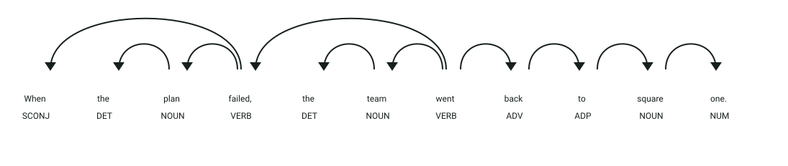

# API de detección de clichés

## Definición

Un cliché es una expresión sobreutilizada que ha perdido parte de su fuerza expresiva por repetirse con frecuencia.
Este servicio detecta clichés en textos en inglés.

## Estructura
El microservicio expone el endpoint HTTP `POST /detectar_cliches/` (puerto `8001`) recibiendo un objeto JSON:

- `texto` → texto en inglés que será analizado en busca de clichés
- `filtrado_inicial` → booleano que activa la fase 1 de coincidencia de n-gramas directos (por defecto `true`)
- `analisis_profundo` → booleano que activa la fase 2 de similitud semántica con SBERT (por defecto `true`)
- `umbral_semantico` → valor flotante entre `0.0` y `1.0` que define el umbral de similitud coseno para SBERT (por defecto `0.75`)

La respuesta devuelve un objeto JSON:

- `cliches_encontrados` → lista de expresiones detectadas como clichés en minúsculas

## Ejemplo

| **Entrada** | **Resultado** |
|-------------|---------------|
| `When the plan failed, the team went back to square one.` | `cliches_encontrados: ["back to square one"]` |
| `This phrase does not match the configured list.` | `cliches_encontrados: []` |

## Objetivo de la api
El servicio recibe un texto en inglés y devuelve las expresiones configuradas como clichés o las expresiones semánticamente similares a ellas mediante un análisis híbrido (reglas de n-gramas lematizados + SBERT).

## Estrategia
La api buscará los **componentes característicos de los clichés:**

1. **Coincidencia directa:** compara n-gramas con el archivo `cliches.txt`.
2. **Normalización lingüística:** usa minúsculas, lematización y normalización de posesivos mediante spaCy.
3. **Análisis semántico:** utiliza SBERT `paraphrase-MiniLM-L6-v2` y similitud coseno.
4. **Ventanas de texto:** compara ventanas deslizantes cuando se activa el análisis profundo.
5. **Filtrado:** aplica el umbral semántico configurado (`umbral_semantico`).

## Ejemplos Visuales

### Estructura Sintáctica del Cliché *"Back to Square One"*

Petición HTTP a `POST /detectar_cliches/`:
```json
{
  "texto": "When the plan failed, the team went back to square one.",
  "filtrado_inicial": true,
  "analisis_profundo": false,
  "umbral_semantico": 0.75
}
```



**Análisis sintáctico y etiquetas (POS y DEP):**
- **`back` (`ADV`, `advmod`)**: Adverbio direccional dependiente del verbo de movimiento `went` (**`ROOT`**).
- **`to` (`ADP`, `prep`)**: Preposición que introduce el sintagma locativo figurado.
- **`square` (`NOUN`, `pobj`)**: Sustantivo núcleo del objeto preposicional.
- **`one` (`NUM`, `nummod`)**: Modificador numeral dependiente de `square`.
- **Detección NLP:** La normalización lingüística de spaCy extrae los n-gramas (`back to square one`), los compara con el corpus de clichés configurado (`cliches.txt`) y, si se activa `analisis_profundo`, calcula embeddings con SBERT para capturar variantes semánticas.

Respuesta del endpoint `POST /detectar_cliches/`:
```json
{
  "cliches_encontrados": [
    "back to square one"
  ]
}
```
