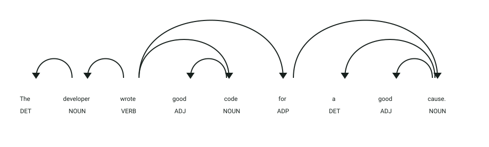

# API de detección de repetición de palabras

## Definición

La repetición de palabras ocurre cuando una palabra aparece varias veces dentro de un texto.
Este servicio encuentra palabras repetidas y cuenta sus apariciones.

## Estructura
El servicio recibe un objeto JSON:

- `texto` → texto que será analizado
- `sin_palabras_frecuentes` → indica si se excluyen palabras frecuentes
- `con_sustantivos_en_singular` → indica si se agrupan los sustantivos por su lema

La respuesta es un diccionario donde cada palabra tiene su cantidad de apariciones.

## Ejemplo

| **Entrada** | **Resultado** |
|-------------|---------------|
| `good morning, good afternoon, and good night` | `good: 3` |
| `The cat and the cat.` | `cat: 2` |

## Objetivo de la api
El servicio recibe un texto y devuelve las palabras repetidas junto con la cantidad de veces que aparecen, aplicando las opciones de filtrado seleccionadas.

## Estrategia
La api buscará los **componentes característicos de la repetición:**

1. **Tokenización:** procesa el texto con spaCy.
2. **Filtrado:** elimina signos de puntuación y, opcionalmente, palabras frecuentes.
3. **Normalización:** puede agrupar sustantivos por su lema.
4. **Conteo:** registra cada palabra y sus posiciones en el texto original.
5. **Respuesta:** transforma el resultado detallado en un diccionario de palabra y cantidad.

## Ejemplos Visuales

### Detección de Palabras Repetidas en Diferentes Contextos Sintácticos

```json
{
  "texto": "The developer wrote good code for a good cause.",
  "sin_palabras_frecuentes": true
}
```



**Análisis sintáctico y etiquetas (POS y DEP):**
- **Primera aparición de `good` (`ADJ`, `amod`)**: Modificador adjetival de `code`, que actúa como objeto directo (`dobj`) de `wrote` (`VERB`, `ROOT`).
- **Segunda aparición de `good` (`ADJ`, `amod`)**: Modificador adjetival de `cause`, que actúa como término de la preposición `for` (`pobj`).
- **`The developer` (`DET`, `NOUN`, `nsubj`)**: Sujeto agente de la acción.
- El servicio tokeniza con spaCy, excluye las palabras vacías frecuentes (*stop words* como `the`, `for`, `a`) y cuenta las recurrencias del lema `good` en el texto.

Respuesta devuelta por la API:
```json
{
  "good": 2
}
```
