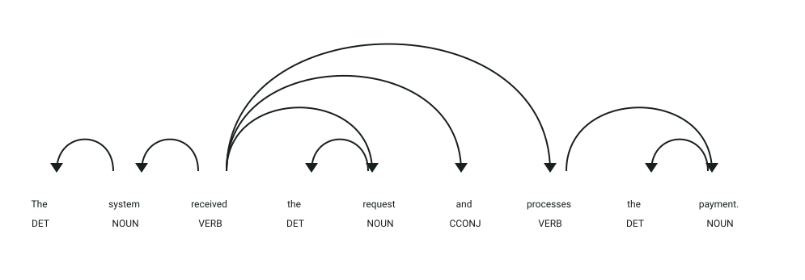
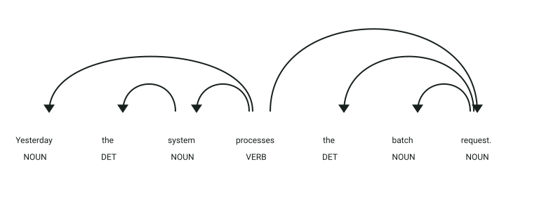

# API de detección de inconsistencias en tiempos verbales

## Simulación interactiva del proceso

```process-demo
```

## Definición

La consistencia en los tiempos verbales es esencial para asegurar la claridad lógica y cronológica en especificaciones de requisitos y redacción técnica.
Este servicio detecta discrepancias de tiempo verbal, saltos injustificados entre presente y pasado, y contradicciones entre verbos y adverbios temporales en oraciones en inglés.

## Estructura

El microservicio expone el endpoint HTTP `POST /analyze` (puerto `8015`) recibiendo un objeto JSON:

- `text` → texto en inglés que será examinado en busca de discordancias temporales

La respuesta devuelve un objeto JSON estructurado con el modelo `AnalyzeResponse`:

- `normalized_text` → texto normalizado procesado
- `fragments` → lista de oraciones o cláusulas evaluadas
- `issues` → lista de inconsistencias detectadas (`IssueResponse`):
  - `fragment` → verbos o segmentos involucrados en la discrepancia
  - `position` → índice de carácter donde se ubica el problema
  - `explanation` → descripción explicativa de la anomalía
  - `error_code` → código de error (`TENSE_MISMATCH`, `TEMPORAL_ADVERB_MISMATCH`, `SUBJECT_VERB_MISMATCH`, etc.)

## Ejemplo

| **Entrada** | **Resultado** |
|-------------|---------------|
| `The system received the request and processes the payment.` | Inconsistencia `TENSE_MISMATCH` detectada entre `received` (pasado) y `processes` (presente). |
| `Yesterday the system processes the batch request.` | Inconsistencia `TEMPORAL_ADVERB_MISMATCH` detectada entre `Yesterday` y `processes`. |
| `The system receives the request and processes the payment.` | Coherencia validada (`issues: []`). |

## Objetivo de la api

El servicio recibe un texto en inglés y valida la estabilidad temporal entre cláusulas dependientes y coordinadas, verificando además la concordancia con adverbios de tiempo y marcadores contextuales para evitar ambigüedades en la ejecución o cronología descrita.

## Estrategia

La api buscará los **componentes característicos de las inconsistencias verbales:**

1. **Segmentación y análisis morfosintáctico:** procesa el texto mediante spaCy, obteniendo árboles de dependencias, etiquetas POS y morfología verbal (tiempos y aspectos).
2. **Identificación de familias temporales:** categoriza cada sintagma verbal en su familia correspondiente (`past`, `pres`, `fut`).
3. **Reglas de detección modular:**
   - **`TenseMismatchRule`:** detecta alternancias no justificadas de pasado y presente en una misma oración coordinada.
   - **`TemporalAdverbRule`:** compara referencias temporales adverbiales (*yesterday*, *tomorrow*, *now*) contra el tiempo verbal asociado.
   - **`SubjectVerbRule`:** evalúa la concordancia de número y persona entre sujeto sintáctico y verbo.
   - **`AuxiliaryMismatchRule`:** revisa la cohesión en secuencias compuestas de verbos auxiliares y participios.
4. **Consolidación de incidencias:** recopila los problemas encontrados y calcula la posición exacta en el texto original.

## Ejemplos Visuales

### Caso 1: Salto Temporal en Cláusulas Coordinadas (`TENSE_MISMATCH`)

Petición HTTP a `POST /analyze`:
```json
{
  "text": "The system received the request and processes the payment."
}
```



**Análisis sintáctico y etiquetas (POS y DEP):**
- **`received` (`VERB`, tag `VBD`, `ROOT`)**: Verbo raíz conjugado en tiempo pasado simple (*past tense*).
- **`and` (`CCONJ`, `cc`)**: Conjunción coordinante que enlaza dos acciones ejecutadas por el mismo sujeto (`system`).
- **`processes` (`VERB`, tag `VBZ`, `conj`)**: Verbo coordinado conjugado en presente simple de tercera persona (*present tense*).
- **Detección de inconsistencia:** El analizador identifica la convivencia simultánea de pasado (*received*) y presente (*processes*) en la misma estructura oracional, reportando un `TENSE_MISMATCH`.

Respuesta del endpoint `POST /analyze`:
```json
{
  "normalized_text": "The system received the request and processes the payment.",
  "fragments": [
    "The system received the request and processes the payment."
  ],
  "issues": [
    {
      "fragment": "processes, received",
      "position": 11,
      "explanation": "The sentence contains both present and past verb tenses.",
      "error_code": "TENSE_MISMATCH"
    }
  ]
}
```

---

### Caso 2: Inconsistencia entre Adverbio Temporal y Verbo (`TEMPORAL_ADVERB_MISMATCH`)

Petición HTTP a `POST /analyze`:
```json
{
  "text": "Yesterday the system processes the batch request."
}
```



**Análisis sintáctico y etiquetas (POS y DEP):**
- **`Yesterday` (`ADV`, `advmod`)**: Modificador adverbial con anclaje temporal intrínseco en tiempo pasado.
- **`processes` (`VERB`, tag `VBZ`, `ROOT`)**: Verbo principal conjugado en tiempo presente simple.
- **Detección de inconsistencia:** La regla `TemporalAdverbRule` detecta el conflicto semántico entre un modificador deíctico pasado (*Yesterday*) y una forma verbal en presente (*processes*), emitiendo la alerta `TEMPORAL_ADVERB_MISMATCH`.

Respuesta del endpoint `POST /analyze`:
```json
{
  "normalized_text": "Yesterday the system processes the batch request.",
  "fragments": [
    "Yesterday the system processes the batch request."
  ],
  "issues": [
    {
      "fragment": "Yesterday, processes",
      "position": 0,
      "explanation": "Temporal adverb 'Yesterday' conflicts with present tense verb 'processes'.",
      "error_code": "TEMPORAL_ADVERB_MISMATCH"
    }
  ]
}
```
