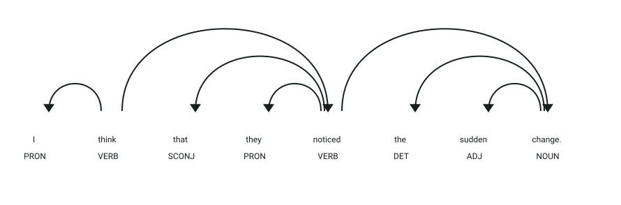

# API de detección de verbos de percepción y opinión

## Definición

Los verbos de percepción y opinión expresan procesos mentales o información recibida por los sentidos.
Este servicio detecta verbos ingleses como `think`, `believe`, `see`, `hear`, `feel`, `notice` y `remember`.

## Estructura
El servicio recibe un objeto JSON:

- `text` → texto en inglés que será analizado

La respuesta contiene:

- `opinion_perception` → verbos de percepción u opinión encontrados
- `others` → tokens restantes del texto

## Ejemplo

| **Entrada** | **Resultado** |
|-------------|---------------|
| `I think this is fine.` | `think` → percepción/opinión |
| `They see the house.` | `see` → percepción/opinión |

## Objetivo de la api
El servicio recibe un texto en inglés y separa los verbos de percepción y opinión del resto de los tokens, ignorando la puntuación.

## Estrategia
La api buscará los **componentes característicos de los verbos de percepción y opinión:**

1. **Análisis lingüístico:** procesa el texto con spaCy.
2. **Categoría gramatical:** conserva tokens cuyo POS sea `VERB`.
3. **Lema:** compara el lema del verbo con la lista configurada.
4. **Clasificación:** agrega los verbos reconocidos a `opinion_perception` y los demás tokens a `others`.

## Ejemplos Visuales

### Identificación de Verbos de Opinión y Percepción en Estructura Clausal

```json
{
  "text": "I think that they noticed the sudden change."
}
```



**Análisis sintáctico y etiquetas (POS y DEP):**
- **`think` (`VERB`, `ROOT`)**: Verbo matriz de actitud proposicional/opinión con categoría gramatical `VERB` y lema `think`.
- **`noticed` (`VERB`, `ccomp`)**: Verbo de percepción sensible que encabeza la cláusula subordinada sustantiva completiva (**`ccomp`**).
- **`that` (`SCONJ`, `mark`)**: Marcador de subordinación que introduce la cláusula dependiente.
- **`I` y `they` (`PRON`, `nsubj`)**: Pronombres sujeto de las respectivas proposiciones.
- **`sudden` (`ADJ`, `amod`)** y **`change` (`NOUN`, `dobj`)**: Objeto directo de la acción de percepción.

Resultado del servicio:
```json
{
  "opinion_perception": ["think", "noticed"],
  "others": ["I", "that", "they", "the", "sudden", "change"]
}
```
