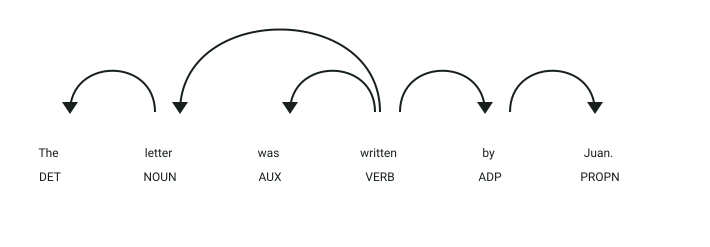
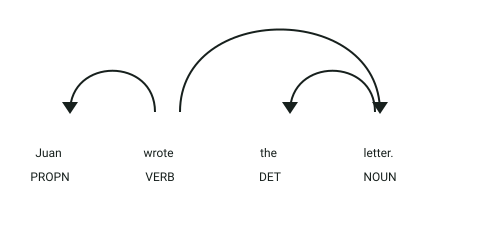

# API de conversión de voz pasiva a activa

## Simulación interactiva del proceso

```process-demo
```

## Definición

La voz pasiva es una estructura gramatical utilizada para resaltar la acción y el objeto que la recibe, en lugar de quien la realiza.
En una oración pasiva, el sujeto no ejecuta la acción, sino que la recibe.

## Estructura
El microservicio expone el endpoint HTTP `POST /detectar_voz_pasiva` (puerto `8011`) recibiendo un payload JSON:

- `texto` → texto en inglés que será analizado en busca de construcciones pasivas

La respuesta devuelve un objeto JSON:

- `is_passive` → valor booleano (`true`/`false`) que indica si la oración está en voz pasiva
- `positions` → lista de tuplas con las posiciones de caracteres `[inicio, fin]` de la construcción pasiva detectada

## Ejemplo

| **Oración** | **Resultado** |
|-------------|---------------|
| `The letter was written by Juan.` | `is_passive: true`, `positions: [[11, 22]]` |
| `Juan wrote the letter.` | `is_passive: false`, `positions: []` |

## Objetivo de la api
El servicio recibe una oración en inglés a través de su endpoint `POST /detectar_voz_pasiva`, analiza su estructura sintáctica con spaCy e identifica si contiene una construcción pasiva y localiza los rangos de caracteres correspondientes. También puede importarse como librería interna (`is_passive`, `passive_positions`).

## Estrategia
El servicio buscará los **componentes característicos de la voz pasiva:**

1. **Análisis lingüístico:** procesa la oración con spaCy y el modelo `en_core_web_sm`.
2. **Auxiliar pasivo:** busca tokens cuya dependencia sintáctica sea `auxpass`.
3. **Participio:** extiende el rango de la construcción hasta el token con etiqueta `VBN`.
4. **Clasificación:** devuelve `True` cuando encuentra una construcción pasiva.

## Ejemplos Visuales

### Caso 1: Oración en Voz Pasiva (`is_passive -> true`)

Petición a la API:
```json
{
  "texto": "The letter was written by Juan."
}
```



**Análisis sintáctico y etiquetas identificadas:**
- **`was` (`AUX`)**: Tiene la dependencia sintáctica **`auxpass`** (auxiliar pasivo) vinculada directamente al verbo principal `written`. Este es el indicador clave que activa la detección.
- **`written` (`VERB`, tag `VBN`)**: Es la raíz sintáctica (`ROOT`) en forma de participio pasado. El detector calcula el rango completo de la perífrasis verbal pasiva (`was written`).
- **`letter` (`NOUN`)**: Recibe la etiqueta de dependencia **`nsubjpass`** (sujeto paciente), demostrando gramaticalmente que no realiza la acción sino que la recibe.
- **`by` (`ADP`)**: Introduce el complemento agente con la relación **`agent`** que conecta hacia el ejecutor `Juan` (`pobj`).

Respuesta del endpoint `POST /detectar_voz_pasiva`:
```json
{
  "is_passive": true,
  "positions": [
    [11, 22]
  ]
}
```

---

### Caso 2: Oración en Voz Activa (`is_passive -> False`)

Para contrastar, la versión en voz activa tiene una estructura sintáctica completamente distinta:

```text
Juan wrote the letter.
```



**Análisis sintáctico y etiquetas identificadas:**
- **`Juan` (`PROPN`)**: Cumple la función de sujeto activo estándar con etiqueta **`nsubj`**.
- **`wrote` (`VERB`)**: Actúa como verbo principal conjugado en pasado simple (`ROOT`), sin ningún auxiliar `auxpass`.
- **`letter` (`NOUN`)**: Pasa a ser el objeto directo con dependencia **`dobj`**.
- Al no existir ningún token con dependencia `auxpass`, el detector clasifica correctamente la oración como no pasiva (`False`).
