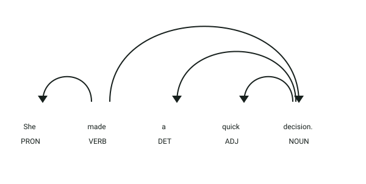
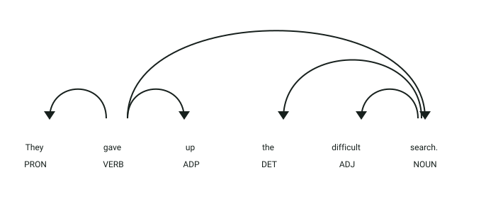

# API de detección de verbos débiles

## Definición

Los verbos débiles son verbos generales o poco expresivos que pueden reemplazarse por verbos más específicos según el contexto.
Este servicio detecta verbos como `make`, `do`, `have`, `get`, `take`, `give` y `be`.

## Estructura
El servicio recibe un objeto JSON:

- `text` → texto en inglés que será analizado

La respuesta es una lista de verbos débiles encontrados.

## Ejemplo

| **Entrada** | **Resultado** |
|-------------|---------------|
| `She made a decision.` | `["made"]` |
| `They gave up.` | No se incluye `gave` porque forma parte de un verbo frasal |

## Objetivo de la api
El servicio recibe un texto en inglés y devuelve los verbos débiles presentes, excluyendo los que forman parte de verbos frasales.

## Estrategia
La api buscará los **componentes característicos de los verbos débiles:**

1. **Análisis lingüístico:** procesa el texto con spaCy.
2. **Categoría gramatical:** identifica verbos y auxiliares.
3. **Lista de referencia:** compara el lema con `WEAK_VERBS`.
4. **Verbos frasales:** excluye los verbos que tienen un hijo con dependencia `prt`.
5. **Resultado:** devuelve las formas de los verbos débiles encontrados.

## Ejemplos Visuales

### Caso 1: Detección de Verbo Débil (`"made"`)

```json
{
  "text": "She made a quick decision."
}
```



**Análisis sintáctico y etiquetas (POS y DEP):**
- **`made` (`VERB`, `ROOT`)**: Su lema es `make`, perteneciente al conjunto configurado de verbos débiles (`WEAK_VERBS`).
- **`She` (`PRON`, `nsubj`)**: Sujeto de la oración.
- **`decision` (`NOUN`, `dobj`)**: Objeto directo de la acción.
- Dado que `made` no tiene partículas frasales asociadas, el detector lo clasifica positivamente como verbo débil:
```json
["made"]
```

---

### Caso 2: Exclusión de Verbo Frasal con Dependencia `prt` (`"give up"`)

```json
{
  "text": "They gave up the difficult search."
}
```



**Análisis sintáctico y etiquetas (POS y DEP):**
- **`gave` (`VERB`, `ROOT`)**: Su lema base es `give`, el cual normalmente sería un verbo débil.
- **`up` (`ADP`, `prt`)**: Posee la etiqueta de dependencia sintáctica **`prt`** (partícula verbal frasal) dependiente de `gave`.
- **Regla lingüística aplicada:** El detector verifica las dependencias sintácticas (`child.dep_ == 'prt'`). Al encontrar la partícula `up`, reconoce la locución verbal *“give up”* y **excluye** el verbo del reporte, devolviendo una lista vacía:
```json
[]
```
